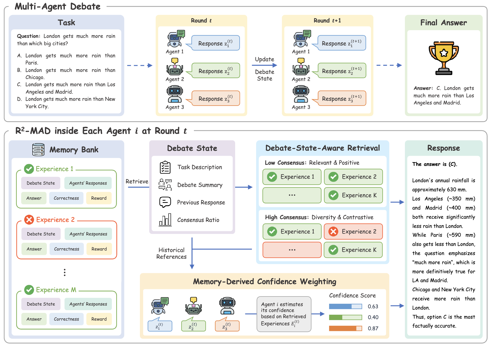

<h1 align='center'>
Remember and Reweight: Enhancing Multi-Agent Debate with<br>
Experience Memory and Confidence Estimation
</h1>

<p align='center'>
  <a href="https://arxiv.org/abs/2609.03619"></a>
  <a href="https://opensource.org/licenses/MIT"></a>
  
</p>

This repository contains the source code of **R<sup>2</sup>-MAD** (**R**emember and **R**eweight for **M**ulti-**A**gent **D**ebate), proposed in [Remember and Reweight: Enhancing Multi-Agent Debate with Experience Memory and Confidence Estimation](https://arxiv.org/abs/2609.03619) (EMNLP 2026 Findings).

## Introduction

Multi-agent debate (MAD) improves LLM reasoning by having multiple agents iteratively refine their responses through discussion, but it suffers from *shared misconception*: when a majority of agents initially converge on a wrong answer, debate amplifies the error instead of correcting it. To mitigate this weakness, we propose **R<sup>2</sup>-MAD**, a framework that equips agents with an experience memory accumulated from past debates. A single retrieval in each debate round serves two complementary purposes — *Remember*: a debate-state-aware policy dynamically calibrates the agent's prior belief by retrieving relevant historical evidence based on the current consensus level; *Reweight*: those retrieved cases estimate how reliable each peer's current stance has proven historically, weighting its influence on the next round.

<p align='center'>
  
</p>

**Figure 1.** Overview of the R<sup>2</sup>-MAD framework. At each debate round, agent $i$ retrieves relevant experiences from its memory bank via a debate-state-aware policy, uses them to calibrate its prior concepts and estimate confidence weights for each peer, and then generates an updated response.

## Project Structure

```
R2-MAD/
├── configs.yaml                 # Model registry: local vLLM + remote API models
├── download_datasets.py         # Fetch raw datasets from HuggingFace
├── prepare_data.py              # Build train/test JSONL splits
├── prepare_memory.py            # Build the ChromaDB memory store
├── run_mad.py                   # MAD / R2-MAD entry point
├── run_cot.py                   # CoT / Self-Consistency baselines
├── scripts/                     # Batch scripts sweeping all models x tasks
└── src/
    ├── multi_agent_debate.py    # Debate orchestration
    ├── agent.py                 # Per-debater prompting + memory pipeline
    ├── retrieval_policy.py      # Pluggable retrieval policies
    ├── memory.py                # ChromaDB vector store wrapper
    ├── models.py                # vLLM / OpenRouter backends + embedding model
    ├── checker.py               # Per-task answer parsing and matching
    ├── prompts.py               # Per-task, per-persona system prompts
    ├── paths.py                 # All directory constants (derived from repo root)
    └── utils/                   # Config, data, memory-case, token-usage helpers
```

## Setups

### Environment

Inference runs locally on GPUs via vLLM.

```bash
conda create -n r2mad python=3.12 -y
conda activate r2mad

pip install vllm==0.8.5          # pulls a matching torch==2.6.0
pip install -r requirements.txt
```

Download the NLTK corpus used for memory-case text processing:

```bash
python -c "import nltk; nltk.download('punkt_tab')"
```

### Models

Register models in [`configs.yaml`](configs.yaml). Each entry declares a `backend`:

```yaml
qwen3-8b:
  backend: vllm                  # local GPU
  model: "Qwen/Qwen3-8B"
  model_path: null               # optional: on-disk weights; null = download from HF

gpt-4o-mini:
  backend: openrouter            # remote API
  model: "openai/gpt-4o-mini"
```

`--model_name` selects the entry, so the same scripts drive either backend with no flag changes.

For the `OpenRouter` backend, copy the env template and fill in your key:

```bash
cp .env.template .env            # then set OPENROUTER_API_KEY
```

### Datasets

Download the raw datasets from HuggingFace → `data/`:

```bash
python download_datasets.py --dataset_name math500
python download_datasets.py --dataset_name mmlu_pro
python download_datasets.py --dataset_name truthfulqa
```

Then build the train/test splits → `processed_data/`. Note the naming difference: MMLU-Pro is downloaded once but processed twice, one subject per call.

```bash
python prepare_data.py --dataset_name math500
python prepare_data.py --dataset_name mmlu_pro_engineering
python prepare_data.py --dataset_name mmlu_pro_economics
python prepare_data.py --dataset_name truthfulqa
```

## Run Experiments

Run all commands from the repository root — `src/` is imported as a namespace package.

### Building the memory

The memory bank must be built before it can be used at inference.

**Step 1 — Collect debate experience** → `memory_data/`

`--train` runs debates on the training split, forces every query through all rounds, and writes one JSONL record per (query, agent, round).

```bash
scripts/run_collect_memory.sh
```

**Step 2 — Build the memory bank** → `persistent_memory/`

Creates a ChromaDB collection named `<task>_<model>` plus a `_doc_embeddings.npz` sidecar of pre-computed embeddings (so MMR re-ranking never re-encodes). **This drops and recreates the collection on each run.**

```bash
scripts/run_prepare_memory.sh
```

### Single run

```bash
# Full R2-MAD
python run_mad.py --task <task> --model_name <debater_model> \
  --n_retrieval <K> --gpu_id <gpu> --embed_gpu_id <embed_gpu> \
  --if_summarize_state --if_use_memory --memory_model <memory_model> \
  --if_confidence_weight --save_log
```

Placeholders: `<task>` is one of the four benchmark names, `<debater_model>` and `<memory_model>` are keys in [`configs.yaml`](configs.yaml), `<K>` is the number of final retrieved cases for each debater, and `<gpu>` / `<embed_gpu>` are device indices.

### Key arguments

| Flag | Description |
| --- | --- |
| `--task` | `MATH500`, `MMLUPro_Engineering`, `MMLUPro_Economics`, `TruthfulQA` |
| `--model_name` | Debater model; must match a `configs.yaml` entry |
| `--memory_model` | Model whose memory collection to retrieve from; falls back to `--model_name` |
| `--n_agents` | Number of debaters (max 6 — one persona each, see `prompts.py`) |
| `--max_round` | Maximum debate rounds |
| `--consensus_threshold` | Fraction of agents that must agree to stop early |
| `--if_use_memory` | Enable experience-memory retrieval |
| `--if_confidence_weight` | Enable memory-based confidence weighting |
| `--if_summarize_state` | Summarize debate state |
| `--n_retrieval` | Cases injected into the prompt |
| `--retrieval_policy` | Retrieval policies supported in `src/retrieval_policy.py`, default: `debate_state_aware` |
| `--gpu_id` / `--embed_gpu_id` | GPU for the LLM / for the embedding model; the latter shares the former unless set |
| `--exp_name` | Output filename prefix used to label variants |
| `--limit` | Cap the number of questions (quick tests) |
| `--save_log` | Write results to `logs/` |

> **Note**: the debater model at inference and the model used to *build* memory are decoupled. All our experiments retrieve from a memory built by one fixed model, so that variation in memory quality across different builder models does not confound the comparison between debaters.

### Batch runs for main results and baselines

We also provide scripts that can sweep all models × all tasks:

```bash
scripts/batch_run_r2mad.sh      # R2-MAD
scripts/batch_run_cot.sh        # CoT baseline
scripts/batch_run_sc.sh         # Self-consistency (9 paths)
scripts/batch_run_mad.sh        # Vanilla MAD
```

## Citation

If you find this work useful, please cite:

```bibtex
@article{jin2026remember,
  title={Remember and Reweight: Enhancing Multi-Agent Debate with Experience Memory and Confidence Estimation},
  author={Jin, Xuanfa and Ma, Zhijian and Zeng, Yongcheng and Cui, Xinyu and Zhang, Haifeng and Wang, Jun},
  journal={arXiv preprint arXiv:2609.03619},
  year={2026},
  url={https://arxiv.org/abs/2609.03619}
}
```

## License

Released under the [MIT License](LICENSE).
